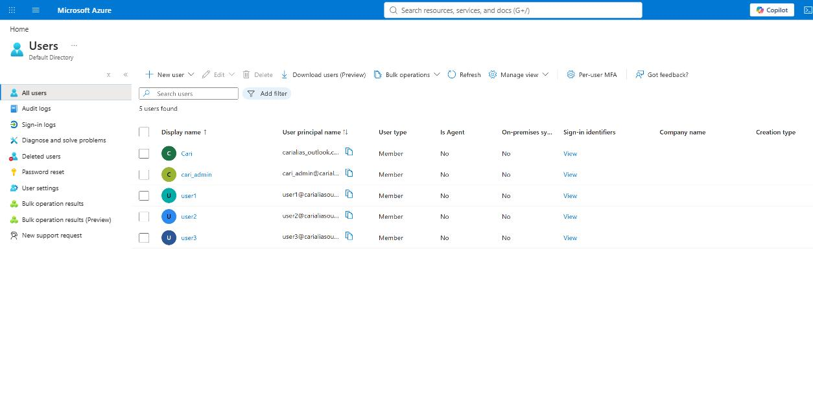
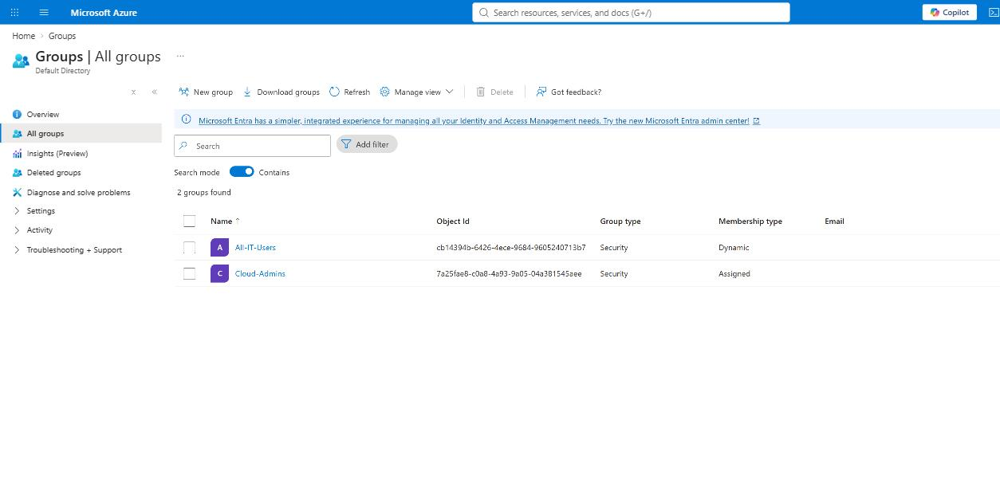
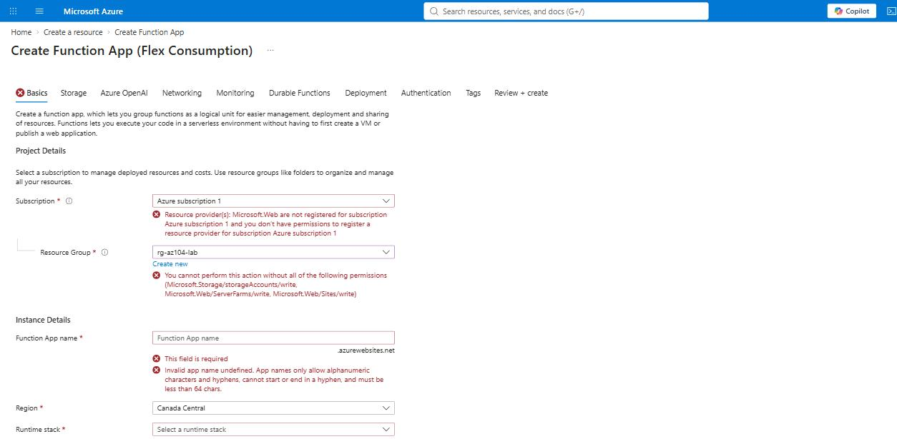

# Azure Administrator Portfolio (AZ-104)

Hands-on lab work built while studying for the Microsoft **AZ-104: Microsoft Azure Administrator** certification. Every environment here is deployed and configured by hand in a live Azure subscription — this isn't a study-guide summary, it's the actual work: users and groups, RBAC and governance, storage, compute, networking, and monitoring, built, tested, and torn down like a real admin would.

**Status:** in progress — updated as labs are completed. See [PROGRESS.md](PROGRESS.md) for the full checklist.

## Why this repo exists

Certifications prove you passed a test. This proves the work happened. Every section below is something I actually configured in Azure, with a screenshot to back it up — including the moments things *didn't* work as expected, because that's usually where the real learning is.

## Skills demonstrated so far

| Area | What was built |
|---|---|
| Identity (Microsoft Entra ID) | Users, security groups, **dynamic group membership rules** driven by a custom attribute |
| Governance & RBAC | Resource group-scoped role assignments (Reader, Virtual Machine Contributor), verified by testing access **as the restricted user** |
| Licensing troubleshooting | Diagnosed and resolved a Microsoft Entra ID P1/P2 licensing gap blocking dynamic groups — including the personal-account vs. work-account trial-activation quirk |

*(This table grows as more labs are completed — see [PROGRESS.md](PROGRESS.md).)*

---

## Lab 1 — Microsoft Entra ID: Users, Groups & Dynamic Membership

**What I did:** Created three test users in Microsoft Entra ID, built a static security group (`Cloud-Admins`) with manual membership, and then built a **dynamic** security group (`All-IT-Users`) driven by a membership rule (`user.jobTitle -eq "IT"`) rather than manual assignment.

**What it demonstrates:** Understanding the difference between assigned and dynamic group membership — dynamic groups evaluate a rule against user attributes automatically, which is how group membership is managed at scale in real organizations instead of manually adding/removing people.

**A real obstacle I hit and solved:** Dynamic group rules initially failed with a `401 — You don't have access` error. Rather than treating that as a dead end, I traced it to a licensing gap — dynamic membership requires Microsoft Entra ID P1/P2, which a fresh tenant doesn't have by default — and resolved it by activating the free trial. That activation had its own quirk: Microsoft's trial signup won't accept a personal Microsoft account even when that account is the tenant's Global Administrator; it requires signing in with a proper `user@tenant.onmicrosoft.com` identity created inside the tenant itself. Diagnosing and fixing that is arguably more representative of real admin work than the original task.


*Three test users created in Microsoft Entra ID.*


*Two groups: `Cloud-Admins` (assigned) and `All-IT-Users` (dynamic membership — rule evaluated successfully, 2 members auto-populated with no manual assignment).*

---

## Lab 2 — RBAC: Scoped Role Assignments (in progress)

**What I did (so far):** Created a resource group (`rg-az104-lab`) and assigned two different roles scoped to it: `Reader` to one test user, `Virtual Machine Contributor` to another. Then signed in **as the Reader-scoped user** and attempted to create a resource, to confirm the restriction actually holds rather than just trusting the portal's description of the role.

**What it demonstrates:** RBAC scope and least-privilege access — a user assigned Reader at the resource group level can see resources but is provably blocked from creating or modifying them, while a Contributor-scoped role for a specific resource type (VMs) can act only within that boundary.


*Signed in as the Reader-scoped test user and attempted to create a Function App — denied on every required permission, confirming the role assignment works as intended.*

**A useful distinction this surfaced:** Microsoft Entra ID roles (like Global Administrator) and Azure subscription RBAC roles (like Owner, Reader, Contributor) are **separate permission systems**. Being a Global Admin over the directory does not automatically grant any access to Azure resources or subscriptions — a distinction that's easy to state and easy to misunderstand until you've actually watched an admin account get blocked from seeing a resource group it doesn't have subscription-level access to.

*(Remaining steps — custom role creation — to be added as completed.)*

---

## Repo structure

```
/screenshots/          → evidence for each lab, named lab{NN}-{description}.png
README.md              → this file — the narrative walkthrough
PROGRESS.md            → full lab checklist, updated as work continues
```

## About this project

I'm currently pursuing the AZ-104 certification as part of a broader path toward cloud security engineering, building on a network/security background (Cisco NAC, Cisco ISE) and a B.S. in Cybersecurity and Information Assurance in progress at WGU. This repo is updated as each lab is completed — check back for more.
